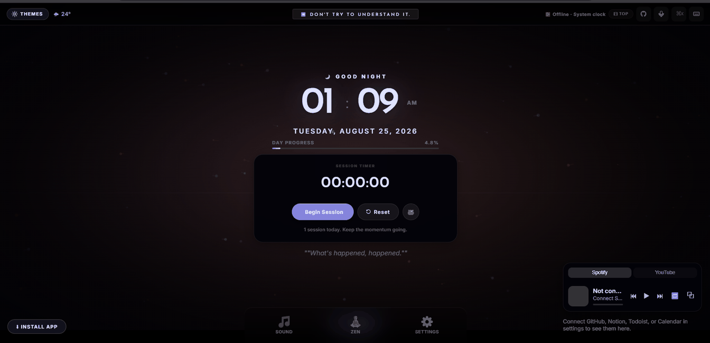

<div align="center">




[](https://www.typescriptlang.org/)
[](package.json)
[](public/manifest.json)
[](LICENSE)
[](https://github.com/ADJ189/Session-clock/security)

[**Open App →**](https://accurate-time.pages.dev/)&nbsp;&nbsp;·&nbsp;&nbsp;[**Wiki →**](https://github.com/ADJ189/Session-clock/wiki)&nbsp;&nbsp;·&nbsp;&nbsp;[Issues](https://github.com/ADJ189/Session-clock/issues)

</div>

---

Session Clock is a precision focus timer built on one idea: **the environment you work in shapes the quality of your work**. 103 animated canvas themes (each with its own bespoke intro transition), a synthesized ambient sound mixer with crossfade scenes, binaural audio, session intelligence, voice control, and Zen Mode — running entirely locally with zero backend.

| | |
|---|---|
| **Themes** | 103 animated, each with a custom intro — TV, film, animation, anime, F1, natural |
| **Sound Mixer** | 17 synthesized ambient tracks · crossfade scenes · night mode · live VU meter |
| **Now Playing** | Matches ~30 soundtracks against Spotify (or any player, manually) and switches theme |
| **Modes** | Pomodoro (fully custom cycles) · **Zen** · **Calm** · **Focus** · Kiosk · PiP · Voice |
| **Intelligence** | Streaks · Velocity · **Flow Intensity** · Configurable break reminders |
| **Always on Top** | Document PiP — mini clock floats over other apps |
| **Languages** | EN ES FR DE JA KO PT HI |
| **Privacy** | Zero backend · localStorage only · No tracking |

**[→ Full documentation on the Wiki](https://github.com/ADJ189/Session-clock/wiki)** &nbsp;·&nbsp; **[→ Changelog](CHANGELOG.md)**

---

## Latest Version : 1.7.1

Check [CHANGELOG.md](CHANGELOG.md) for the version details.

---

## Quick Start

```bash
git clone https://github.com/ADJ189/Session-clock
cd Session-clock
npm install && npm run dev       # localhost:5173
npm run typecheck                # strict TypeScript check
npm run build                    # production → dist/
```

Push to `main` → **Settings → Pages → GitHub Actions** to deploy. The included workflow handles `typecheck → build → deploy` automatically.

---

## Key Shortcuts

`Space` start/pause &nbsp;·&nbsp; `Z` Zen Mode &nbsp;·&nbsp; `T` next theme &nbsp;·&nbsp; `Ctrl+K` command palette &nbsp;·&nbsp; `Esc` exit

**[→ All shortcuts on the Wiki](https://github.com/ADJ189/Session-clock/wiki/Keyboard-Shortcuts)**

---

## Secret Themes

🎮 **8-BIT** — `↑↑↓↓←→←→BA` &nbsp;·&nbsp; 🔥 **Phoenix** — 100 sessions &nbsp;·&nbsp; 🍳 **The Bear** — type `thebear`

**[→ All easter eggs on the Wiki](https://github.com/ADJ189/Session-clock/wiki/Easter-Eggs)**

---

## Contributing

Bug reports and PRs are welcome — see [CONTRIBUTING.md](CONTRIBUTING.md)
for setup, project layout, and how to configure OAuth for local dev.
Third-party fonts, APIs, and tooling are listed in [CREDITS.md](CREDITS.md).

## License

[AGPL-3.0](LICENSE) — free to use and fork; modifications must be open-sourced.

---

<div align="center">
<sub>28 modules · 1 runtime dep (anime.js) · 103 themes · 17 ambient sounds · 20+ easter eggs · 8 languages · Flow Intensity</sub>

---

Made with ❤️ by **ADJ189**

*"Focus is the art of knowing what to ignore."*
</div>
