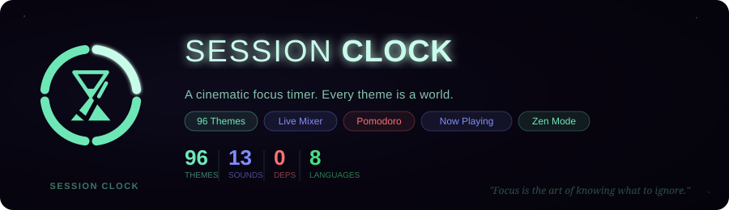
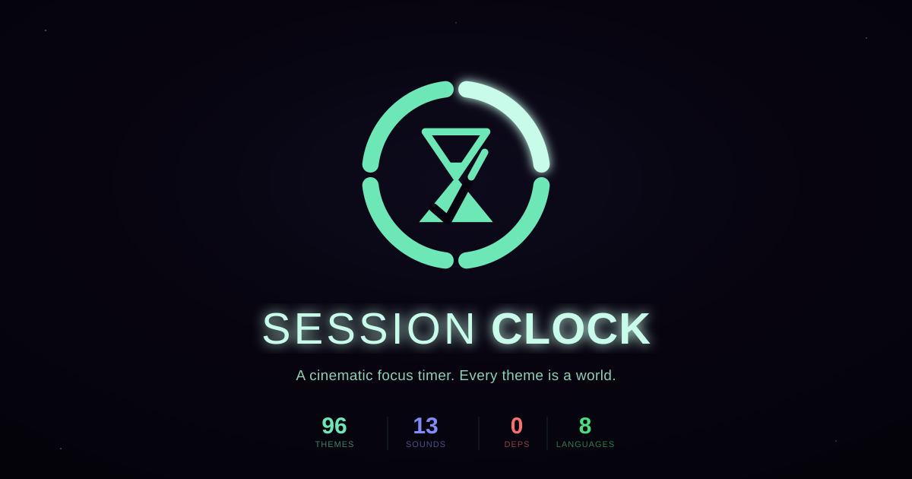

<div align="center">





[](https://github.com/ADJ189/Session-clock/actions)
[](https://www.typescriptlang.org/)
[](package.json)
[](public/manifest.json)
[](LICENSE)
[](https://github.com/ADJ189/Session-clock/security)

[**Open App →**](https://accurate-time.pages.dev/)&nbsp;&nbsp;·&nbsp;&nbsp;[**Wiki →**](https://github.com/ADJ189/Session-clock/wiki)&nbsp;&nbsp;·&nbsp;&nbsp;[Issues](https://github.com/ADJ189/Session-clock/issues)

</div>

---

Session Clock is a precision focus timer built on one idea: **the environment you work in shapes the quality of your work**. 96 animated canvas themes (each with its own bespoke intro transition), a synthesized ambient sound mixer with crossfade scenes, binaural audio, session intelligence, voice control, and Zen Mode — running entirely locally with zero backend.

| | |
|---|---|
| **Themes** | 96 animated, each with a custom intro — TV, film, animation, anime, F1, natural |
| **Sound Mixer** | 17 synthesized ambient tracks · crossfade scenes · night mode · live VU meter |
| **Now Playing** | Matches ~30 soundtracks against Spotify (or any player, manually) and switches theme |
| **Modes** | Pomodoro (fully custom cycles) · **Zen** · **Calm** · **Focus** · Kiosk · PiP · Voice |
| **Intelligence** | Streaks · Velocity · **Flow Intensity** · Configurable break reminders |
| **Always on Top** | Document PiP — mini clock floats over other apps |
| **Languages** | EN ES FR DE JA KO PT HI |
| **Privacy** | Zero backend · localStorage only · No tracking |

**[→ Full documentation on the Wiki](https://github.com/ADJ189/Session-clock/wiki)** &nbsp;·&nbsp; **[→ Changelog](CHANGELOG.md)**

---

## What's New in 1.4.0

- **Head-tracked spatial audio** — turn your phone and the ambient soundstage stays anchored in place, like AirPods spatial audio. Built on the existing 3D Spatial Audio panning engine.
- **4 new ambient sounds**: White Noise, Pink Noise, Rain on Roof, and Airplane Cabin — the mixer now has 17 tracks total.
- **Fixed two sounds that silently ignored their own volume slider** (Forest's bird chirps, Fireplace's crackle) — both now respond to per-track volume and spatial panning correctly.
- **Platform-aware optimizations** — a real OS/browser-engine detection layer now backs the app, so features that only exist on some platforms (haptic vibration, Document Picture-in-Picture pop-outs, iOS's gyroscope permission prompt) behave correctly instead of silently failing or showing a dead button.
- **Fixed a mobile layout bug**: the header could overlap itself on phone-width screens; it now collapses sensibly, and a long-standing bug where gyroscope parallax never actually worked on iPhone/iPad (missing the required iOS motion-permission request) is fixed.
- **Haptic Feedback** setting for Pomodoro start/complete, on devices that support it.
- **Hide Seconds / Hide Milliseconds**, and **per-clock-style center mode** — Digital, Analogue, Flip, Word, Minimal, and Segment clocks now each remember their own Top/Centre preference and scale properly (larger, sharper canvases) when centered, instead of sharing one global setting tuned only for the digital clock.

*1.4.1 was a maintenance-only pass (24 dead exports removed, no behavior changes). 1.4.2 gave 35 of the 96 themes — including Fargo, Ghibli, John Wick, The Batman, and Zen Garden — their own background renderer for the first time; they'd been silently falling back to a generic particle background since they were added. See [Changelog](CHANGELOG.md#142--every-theme-now-has-its-own-background-35-themes-were-silently-falling-back-to-generic-particles) for the full list and audit notes.*
- **New animated splash intro** and **app icon** using the new hourglass logo — the inner triangle spins while sources load and eases to a stop once ready.
- **Music dock**: real in-page Spotify playback (Web Playback SDK), pop-out via Document Picture-in-Picture, optional auto-sync with focus/break, plus a YouTube tab via the official IFrame Player API.
- **Focus sidebar task cards**: compact GitHub, Notion, Todoist, and Calendar cards next to the music dock.
- **33 new themes** across TV, film, anime, animation, F1, and ambient categories — Fargo, Twin Peaks, The Batman, Your Name, Studio Ghibli, Spider-Verse, Zen Garden, and more. Each has its own bespoke canvas intro transition, not a generic fade.
- **7 new ambient sounds** (Wind, Snowfall, Keyboard, Library, Spaceship, Campfire, Waves & Rocks) — synthesized entirely in-browser, no audio files.
- **Sound Mixer redesign**: live output meter, night mode, crossfade Scenes that blend your ambient mix as Pomodoro moves between focus and break.
- **Now Playing → Theme**: recognizes soundtracks from what's currently playing (Spotify, or type it in manually for any player) and switches the theme to match.
- **Custom Pomodoro cycles**, configurable break reminders, an opt-in idle nudge, Calm Mode, Focus Mode, and an always-on-top mini clock.
- Removed leftover Token Shop remnants (dead UI from an early, since-removed feature). Fixed theme picker icons not rendering, rain/fireplace sounds silently failing to autoplay, a dead "Smart Break Reminder" toggle, and a handful of memory leaks.

See [CHANGELOG.md](CHANGELOG.md) for the full list.

---

## Quick Start

```bash
git clone https://github.com/ADJ189/Session-clock
cd Session-clock
npm install && npm run dev       # localhost:5173
npm run typecheck                # strict TypeScript check
npm run build                    # production → dist/
```

Push to `main` → **Settings → Pages → GitHub Actions** to deploy. The included workflow handles `typecheck → build → deploy` automatically.

---

## Key Shortcuts

`Space` start/pause &nbsp;·&nbsp; `Z` Zen Mode &nbsp;·&nbsp; `T` next theme &nbsp;·&nbsp; `Ctrl+K` command palette &nbsp;·&nbsp; `Esc` exit

**[→ All shortcuts on the Wiki](https://github.com/ADJ189/Session-clock/wiki/Keyboard-Shortcuts)**

---

## Secret Themes

🎮 **8-BIT** — `↑↑↓↓←→←→BA` &nbsp;·&nbsp; 🔥 **Phoenix** — 100 sessions &nbsp;·&nbsp; 🍳 **The Bear** — type `thebear`

**[→ All easter eggs on the Wiki](https://github.com/ADJ189/Session-clock/wiki/Easter-Eggs)**

---

## Contributing

Bug reports and PRs are welcome — see [CONTRIBUTING.md](CONTRIBUTING.md)
for setup, project layout, and how to configure OAuth for local dev.
Third-party fonts, APIs, and tooling are listed in [CREDITS.md](CREDITS.md).

## License

[AGPL-3.0](LICENSE) — free to use and fork; modifications must be open-sourced.

---

<div align="center">
<sub>28 modules · 0 runtime deps · 96 themes · 17 ambient sounds · 20+ easter eggs · 8 languages · Flow Intensity</sub>

---

Made with ❤️ by **ADJ189**

*"Focus is the art of knowing what to ignore."*
</div>
